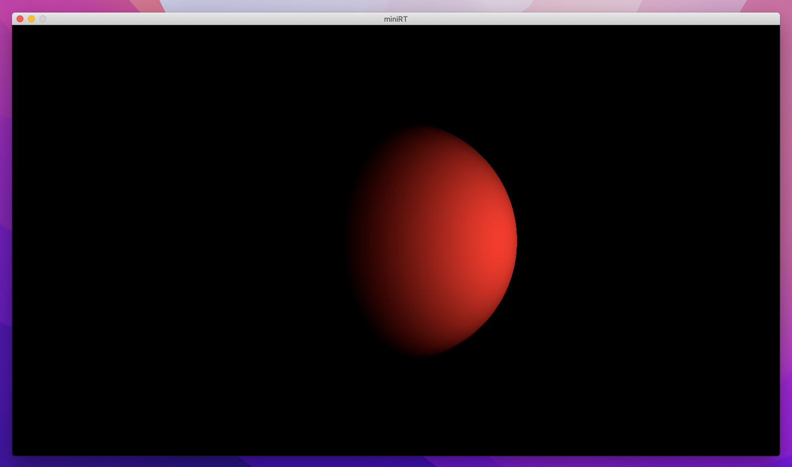
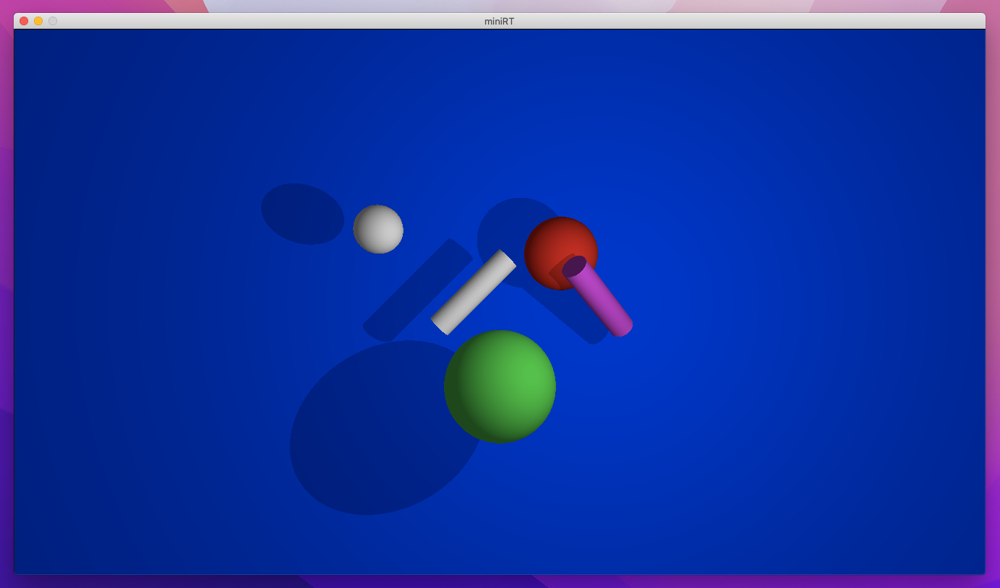
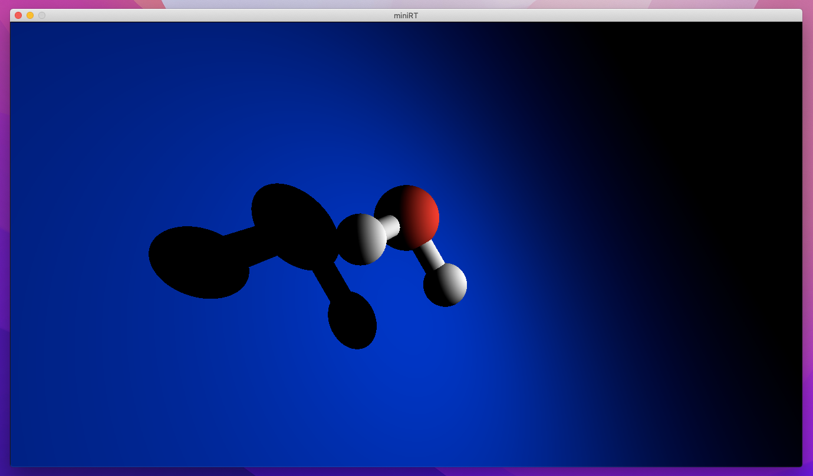
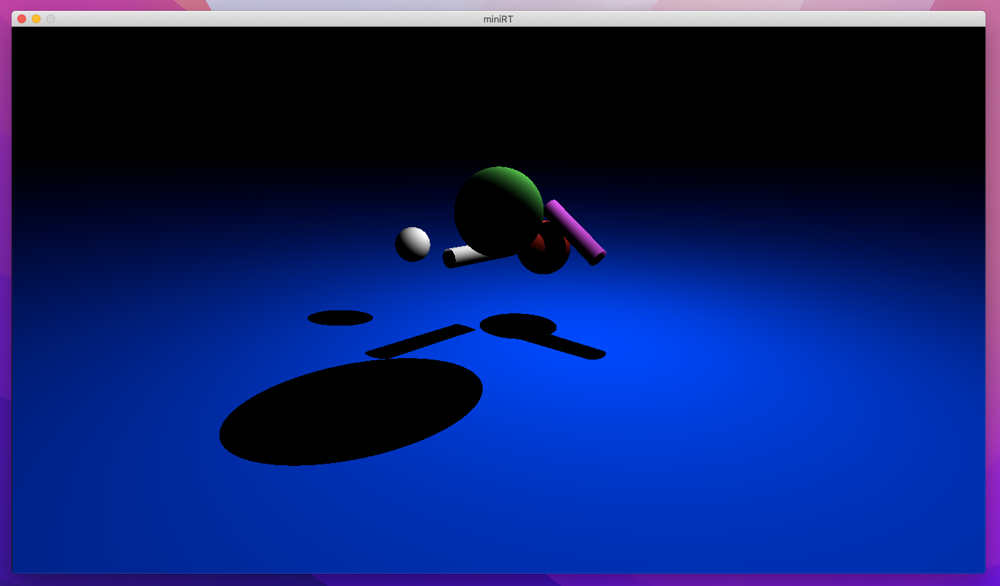

# miniRT

miniRT is a minimal raytracer project developed as part of the Ecole 42 curriculum. This raytracer is capable of rendering scenes with spheres, planes, and cylinders. Users have the freedom to position the camera, specify ambient lighting, and add a spotlight. The project calculates diffuse lighting on objects based on the provided scene description in a .rt file.

This project was written in C with the miniLibX graphic library that allowed us to open a window and to draw pixels in it. The rest is pure mathematics.



## What is Ray Tracing?

Ray tracing is a rendering technique used in computer graphics to simulate how light interacts with objects in a 3D environment. It produces realistic images by modeling the behavior of light rays.

Basic steps of ray tracing:
- **Rays of Light:** Virtual camera sends out rays into the 3D scene.
- **Intersection Testing:** Checks for ray-object intersections.
- **Shading and Rendering:** Calculates color and brightness at intersections.

## Usage

First, clone the repo to your local machine. Then build the project with the makefile. In the root of the projec in the terminal, write:
```bash
make
```
The executable will have the name "miniRT".

To render a scene, run the `miniRT` executable with the path to a .rt file as the argument. For example:

```bash
./miniRT scenes/my_scene.rt
```

## Scene Description

To create a scene for rendering, you need to specify camera, lighting and basic shapes in a .rt file. The following objects are supported:

- `C`: Define the camera's position, direction, and field of view.
- `L`: Add a spotlight with position, brightness, and color.
- `A`: Set the ambient lighting with brightness and color.
- `sp`: Create a sphere with position, diameter, and color.
- `pl`: Add a plane with position, normal orientation, and color.
- `cy`: Include a cylinder with position, orientation, diameter, height, and color.

## Example Scene
```plaintext
C 0,0,20 0,0,-1 90
L 10,0,0 0.5 255,255,255
A 0.3 255,255,255

sp 5,4,-20 3 255,0,0
sp 0,-6,-15 4 40,255,100
sp -10,6,-20 2 255,255,255

cy -5,-2,-20 1,1,0 1 8 255,255,255
cy 10,-2,-20 -1,1,1 1 8 255,0,255

pl 0,0,-30 0,0,1 0,0,255
```

## Some Screenshots


